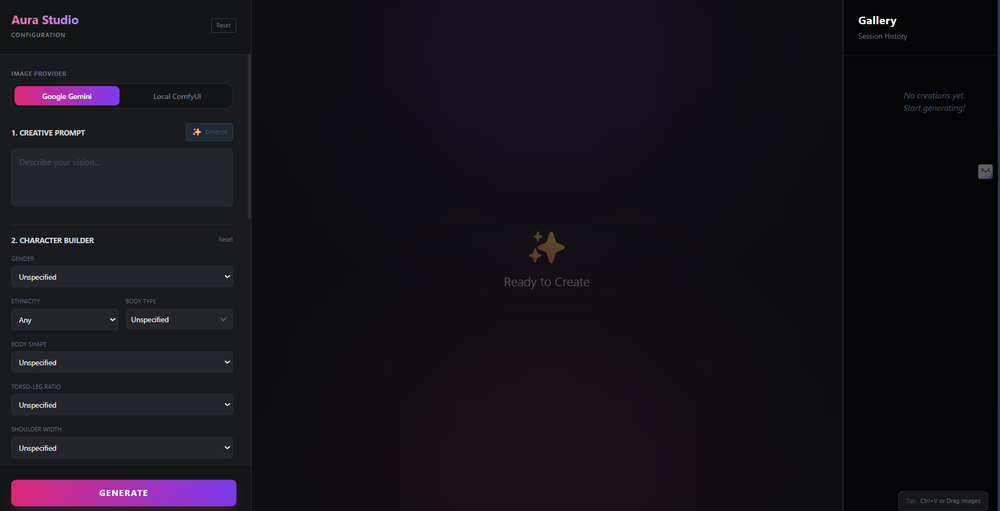

# Aura Studio



A professional AI image generation studio powered by **Next.js**, **Google Gemini**, and **ComfyUI**.

## Features

- **Multi-Provider Generation**: Seamlessly switch between Google Gemini (Cloud) and ComfyUI (Local).
- **Z-Image Turbo Support**: Optimized workflows for specialized Lumina-2 and Turbo models.
- **Advanced Character Builder**: Detailed ethnicty, body type, and style controls.
- **Reference Image Integration**: Multi-image face and background reference support via IP-Adapter.
- **ControlNet Support**: Precise structural control for local generations.
- **Prompt Enhancer**: AI-powered prompt refinement and expansion.
- **Real-time Feedback**: Live status monitoring for local ComfyUI connections.

## Tech Stack

- **Framework**: Next.js 14
- **Styling**: Tailwind CSS
- **AI Integration**: Google Generative AI SDK (Gemini)
- **Local Backend**: ComfyUI API integration
- **Storage**: Supabase (optional integration)

## Getting Started

### Prerequisites

- Node.js 18+
- npm or yarn
- (Optional) Local ComfyUI instance running on `http://127.0.0.1:8188`

### Installation

1. Clone the repository
2. Install dependencies:
   ```bash
   npm install
   ```
3. Set up environment variables:
   Copy `.env.example` to `.env` and add your keys:
   - `NEXT_PUBLIC_GOOGLE_API_KEY`: Your Gemini API key
   - `NEXT_PUBLIC_COMFY_URL`: Your local ComfyUI URL

### Running the App

```bash
npm run dev
```

Open [http://localhost:3000](http://localhost:3000) to start generating.

## License

MIT
